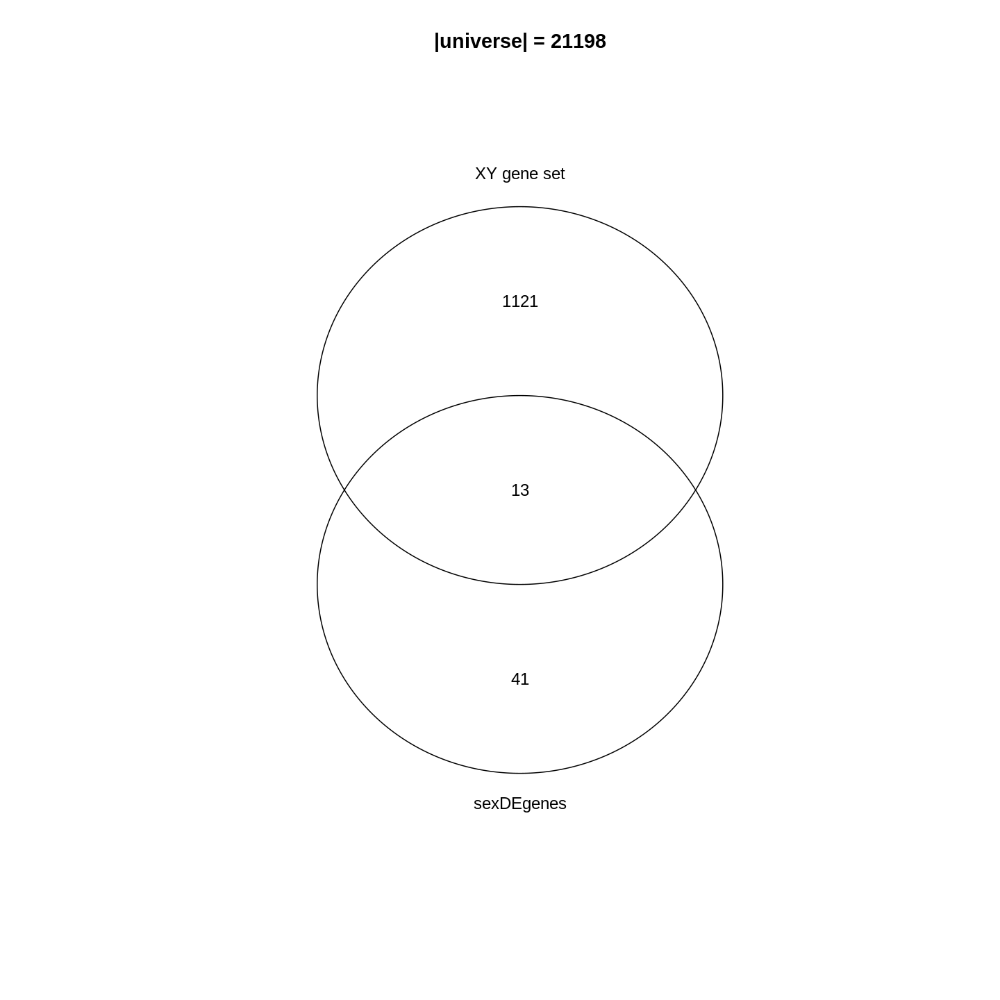
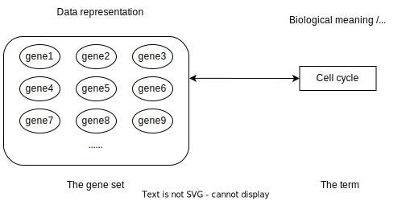
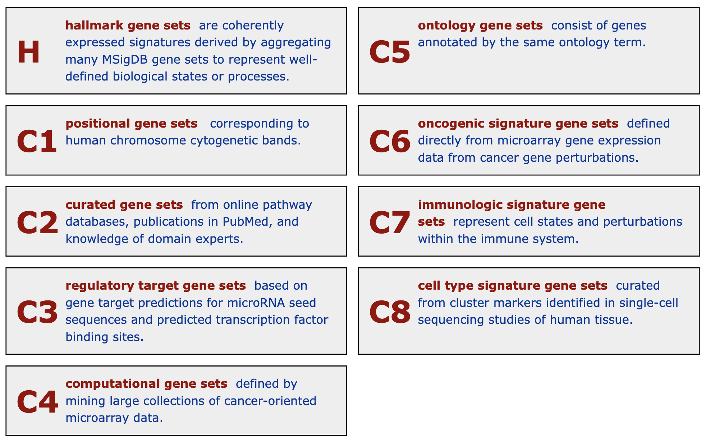
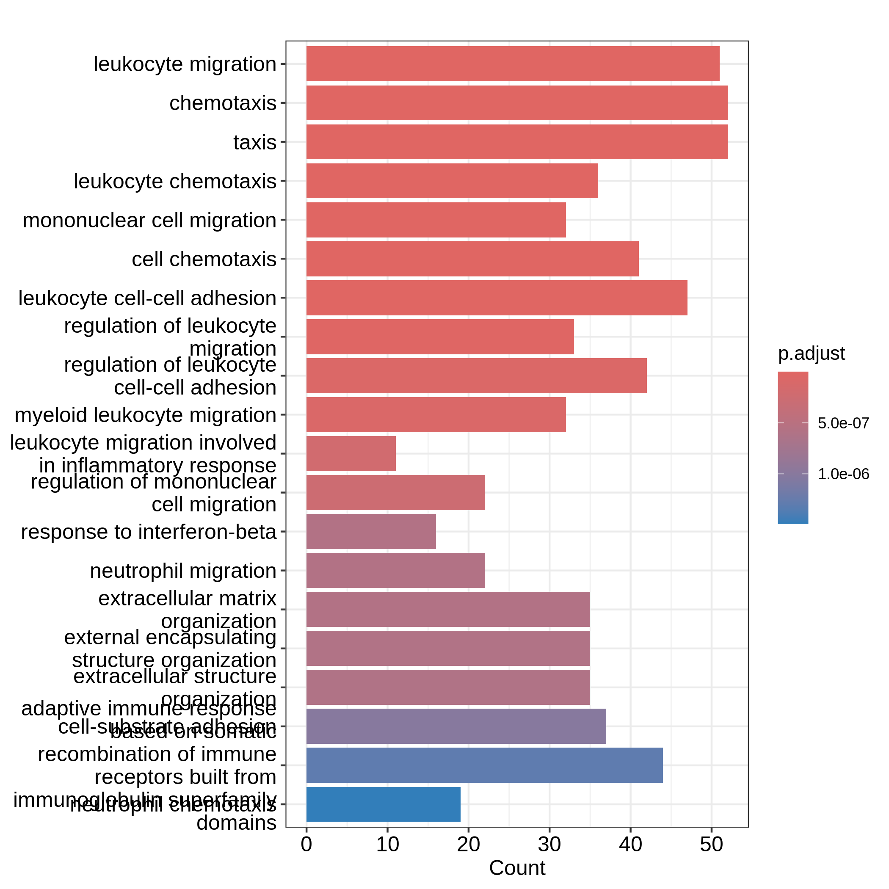
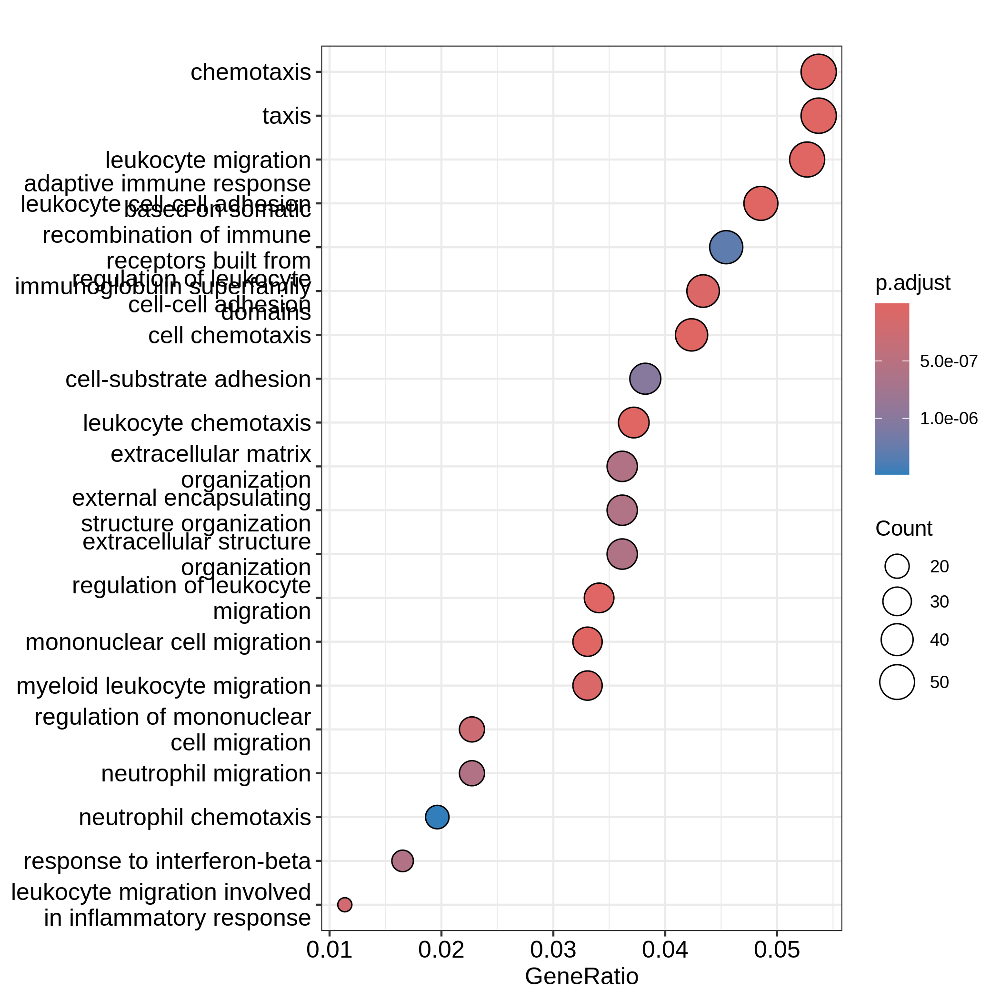
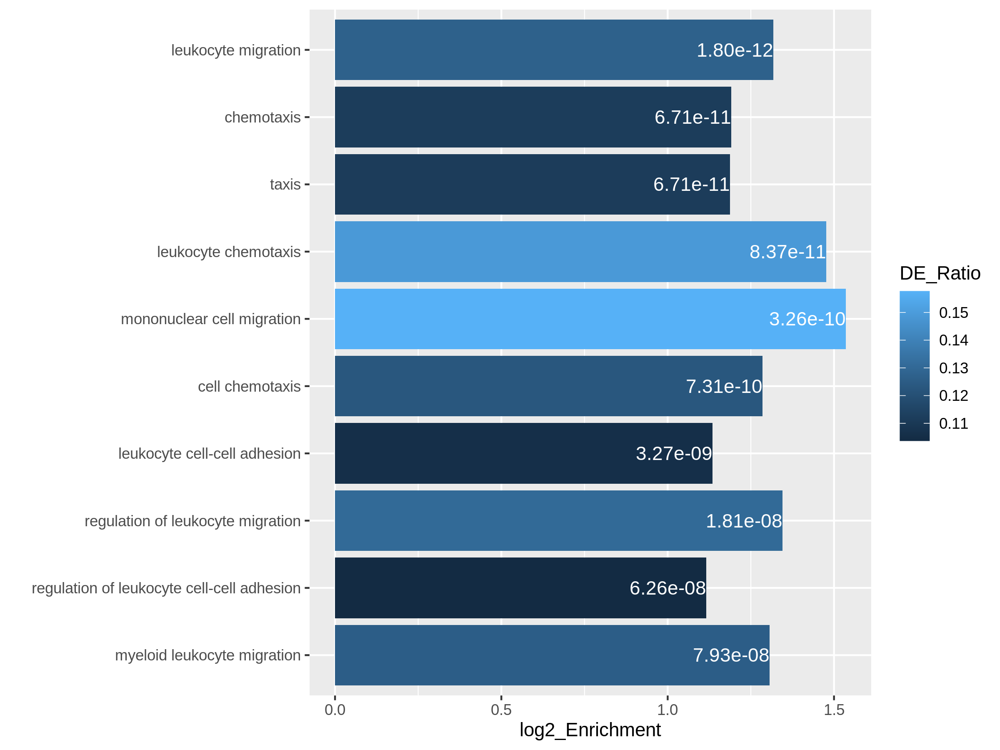
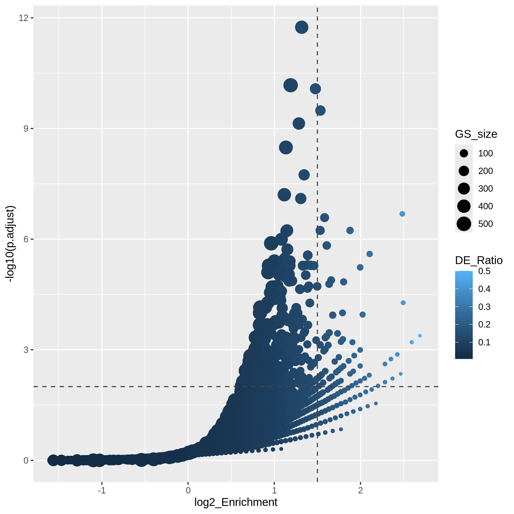
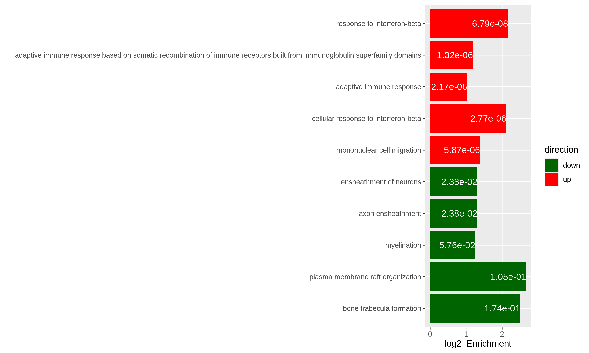
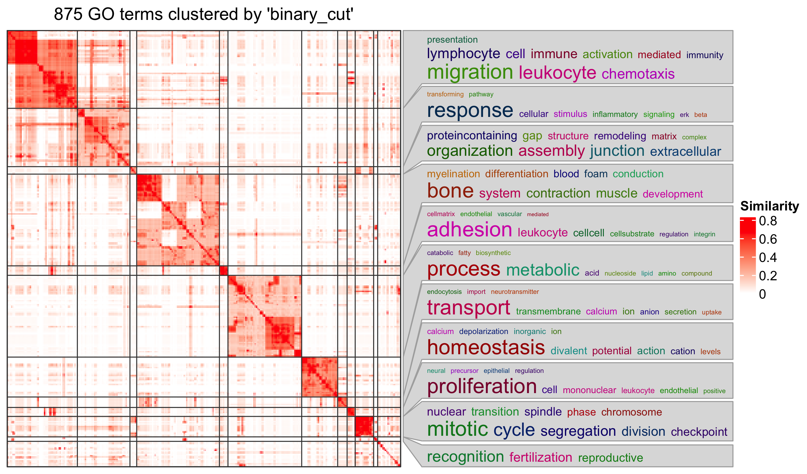

<style>
body h3 {
    margin-top: 50px;
}
</style>

::::::::::::::::::::::::::::::::::::::: objectives

- Learn the method of gene set enrichment analysis.
- Learn how to obtain gene sets from various resources in R.
- Learn how to perform gene set enrichment analysis and how to visualize
  enrichment results.

::::::::::::::::::::::::::::::::::::::::::::::::::

:::::::::::::::::::::::::::::::::::::::: questions

- What is the aim of performing gene set enrichment analysis?
- What is the method of over-representation analysis?
- What are the commonly-used gene set databases?

::::::::::::::::::::::::::::::::::::::::::::::::::


After we have obtained a list of differentially expressed (DE) genes, the next
question naturally to ask is what biological functions these DE genes may
affect. Gene set enrichment analysis (GSEA) evaluates the associations of a
list of DE genes to a collection of pre-defined gene sets, where each gene set
has a specific biological meaning. Once DE genes are significantly enriched in
a gene set, the conclusion is made that the corresponding biological meaning
(e.g. a biological process or a pathway) is significantly affected.

The definition of a gene set is very flexible and the construction of gene
sets is straightforward. In most cases, gene sets are from public databases
where huge efforts from scientific curators have already been made to
carefully categorize genes into gene sets with clear biological meanings.
Nevertheless, gene sets can also be self-defined from individual studies, such
as a set of genes in a network module from a co-expression network analysis,
or a set of genes that are up-regulated in a certain disease.

There are a huge amount of methods available for GSEA analysis. In this
episode, we will learn the simplest but the mostly used one: the
over-representation analysis (ORA). ORA is directly applied to the list of DE
genes and it evaluates the association of the DE genes and the gene set by the
numbers of genes in different categories.

Please note, ORA is a universal method that it can not only be applied to the
DE gene list, but also any type of gene list of interest to look for their
statistically associated biological meanings.

In this episode, we will start with a tiny example to illustrate the
statistical method of ORA. Next we will go through several commonly-used gene
set databases and how to access them in R. Then, we will learn how to perform
ORA analysis with the Bioconductor package **clusterProfiler**. And in the
end, we will learn several visualization methods on the GSEA results.

Following is a list of packages that will be used in this episode:


``` r
library(SummarizedExperiment)
library(DESeq2)
library(gplots)
library(microbenchmark)
library(org.Hs.eg.db)
library(org.Mm.eg.db)
library(msigdbr)
library(clusterProfiler)
library(enrichplot)
library(ggplot2)
library(simplifyEnrichment)
```


## The statistical method

To demonstrate the ORA analysis, we use a list of DE genes from a comparison
between genders. In the end, we have a list
of DE genes filtered by FDR < 0.05, and save it in the object `sexDEgenes`.


``` r
library(SummarizedExperiment)
library(DESeq2)

# read the example dataset which is a `RangedSummarizedExperiment` object
se <- readRDS("data/GSE96870_se.rds")

# only restrict to mRNA (protein-coding genes)
se <- se[rowData(se)$gbkey == "mRNA"]

# construct a `DESeqDataSet` object where we also specify the experimental design
dds <- DESeqDataSet(se, design = ~ sex + time)
# perform DESeq2 analysis
dds <- DESeq(dds)
# obtain DESeq2 results, here we only want Male vs Female in the "sex" variable
resSex <- results(dds, contrast = c("sex", "Male", "Female"))
# extract DE genes with padj < 0.05
sexDE <- as.data.frame(subset(resSex, padj < 0.05))
# the list of DE genes
sexDEgenes <- rownames(sexDE)
```

Let's check the number of DE genes and how they look like. It seems the number
of DE genes is very small, but it is OK for this example.


``` r
length(sexDEgenes)
```

``` output
[1] 54
```

``` r
head(sexDEgenes)
```

``` output
[1] "Lgr6"   "Myoc"   "Fibcd1" "Kcna4"  "Ctxn2"  "S100a9"
```

Next we construct a gene set which contains genes on sex chromosomes (let's
call it the "_XY gene set_"). Recall the `RangedSummarizedExperiment` object
also includes genomic locations of genes, thus we can simply obtain sex genes
by filtering the chromosome names.

In the following code, `geneGR` is a `GRanges` object on which `seqnames()` is
applied to extract chromosome names. `seqnames()` returns a special data
format and we need to explicitly convert it to a normal vector by
`as.vector()`.


``` r
geneGR <- rowRanges(se)
totalGenes <- rownames(se)
XYGeneSet <- totalGenes[as.vector(seqnames(geneGR)) %in% c("X", "Y")]
head(XYGeneSet)
```

``` output
[1] "Gm21950"   "Gm14346"   "Gm14345"   "Gm14351"   "Spin2-ps1" "Gm3701"   
```

``` r
length(XYGeneSet)
```

``` output
[1] 1134
```

The format of a single gene set is very straightforward, which is simply a
vector. The ORA analysis is applied on the DE gene vector and gene set vector.

Before we move on, one thing worth to mention is that ORA deals with two gene
vectors. To correctly map between them, gene ID types must be consistent in
the two vectors. In this tiny example, since both DE genes and the _XY gene
set_ are from the same object `se`, they are ensured to be in the same gene ID
types (the gene symbol). But in general, DE genes and gene sets are from two
different sources (e.g. DE genes are from researcher's experiment and gene
sets are from public databases), it is very possible that gene IDs are not
consistent in the two. Later in this episode, we will learn how to perform
gene ID conversion in the ORA analysis.


Since the DE genes and the gene set can be mathematically thought of as two sets,
a natural way is to first visualize them with a Venn diagram.


``` r
library(gplots)
plot(venn(list("sexDEgenes"  = sexDEgenes, 
               "XY gene set" = XYGeneSet)))
title(paste0("|universe| = ", length(totalGenes)))
```



In the Venn diagram, we can observe that around 1.1% (13/1134) of genes in the
_XY gene set_ are DE. Compared to the global fraction of DE genes (54/21198 =
0.25%), it seems there is a strong relations between DE genes and the gene
set. We can also compare the fraction of DE genes that belong to the gene set
(13/54 = 24.1%) and the global fraction of _XY gene set_ in the genome
(1134/21198 = 5.3%). On the other hand, it is quite expected because the two
events are actually biologically relevant where one is from a comparison
between genders and the other is the set of gender-related genes.

Then, how to statistically measure the enrichment or over-representation? Let's
go to the next section.

### Fisher's exact test

To statistically measure the enrichment, the relationship of DE genes and the
gene set is normally formatted into the following 2x2 contingency table.
We can use a 2 x 2 table, where the four data points are (from top left to bottom right): 

- the number of genes that are both in the category and are differentially expressed.

- the number of differentially expressed genes not in the category.

- the number of category genes that are not differentially expressed.

- the number of genes that are neither in the category nor differentially expressed.

<center>
|            | In the gene set | Not in the gene set | Total
| ---------- | --------------- | --------------------| -------
|  **DE**    |     $13$    |    $41$         | $54$
| **Not DE** |     $1121$    |    $20023$         | $21144$
| **Total**  |     $1134$    |    $20064$         | $21198$
</center>


All the values are:


``` r
hypergeoDistMatrix <- matrix(c(13,1121,1134,41,20023,20064,54, 21144, 21198),3,3)

hypergeoDistMatrix
```

``` output
     [,1]  [,2]  [,3]
[1,]   13    41    54
[2,] 1121 20023 21144
[3,] 1134 20064 21198
```


Fisher's exact test can be used to test the associations of the two marginal
attributes, i.e. is there a dependency of a gene to be a DE gene and to be in
the _XY gene set_? In R, we can use the function `fisher.test()` to perform
the test. The input is the top-left 2x2 sub-matrix. We specify `alternative =
"greater"` in the function because we are only interested in
over-representation.


``` r
fisher.test(matrix(c(13, 1121, 41, 20023), nrow = 2, byrow = TRUE),
    alternative = "greater")
```

``` output

	Fisher's Exact Test for Count Data

data:  matrix(c(13, 1121, 41, 20023), nrow = 2, byrow = TRUE)
p-value = 3.906e-06
alternative hypothesis: true odds ratio is greater than 1
95 percent confidence interval:
 3.110607      Inf
sample estimates:
odds ratio 
  5.662486 
```

In the output, we can see the _p_-value is very small (`3.906e-06`), then we
can conclude DE genes have a very strong enrichment in the _XY gene set_.

Results of the Fisher's Exact test can be saved into an object `t`, which is a
simple list, and the _p_-value can be obtained by `t$p.value`.


``` r
t <- fisher.test(matrix(c(13, 1121, 41, 20023), nrow = 2, byrow = TRUE),
    alternative = "greater")
t$p.value
```

``` output
[1] 3.9059e-06
```

If there is no association between DE genes and the gene set, odds ratio is
expected to be 1. And it is larger than 1 if there is an over-representation
of DE genes on the gene set.

:::::::::::::::::::::::::::::::::::::::::  callout

### Further reading

Current tools also use Binomial distribution or chi-square test for ORA
analysis. These two are just approximations. Please refer to [Rivals et al.,
Enrichment or depletion of a GO category within a class of genes: which test?
Bioinformatics 2007](https://doi.org/10.1093/bioinformatics/btl633) which gives
an overview of statistical methods used in ORA analysis.

::::::::::::::::::::::::::::::::::::::::::::::::::


## Gene set resources

We have learnt the basic methods of ORA analysis. Now we go to the second
component of the analysis: the gene sets.

Gene sets represent prior knowledge of what is the general shared biological
attribute of genes in the gene set. For example, in a "cell cycle" gene set,
all the genes are involved in the cell cycle process. Thus, if DE genes are
significantly enriched in the "cell cycle" gene set, which means there are
significantly more cell cycle genes differentially expressed than
expected, we can conclude that the normal function of cell cycle process may
be affected.

As we have mentioned, genes in the gene set share the same "biological
attribute" where "the attribute" will be used for making conclusions. The
definition of "biological attribute" is very flexible. It can be a biological
process such as "cell cycle". It can also be from a wide range of other
definitions, to name a few:

- Locations in the cell, e.g. cell membrane or cell nucleus.
- Positions on chromosomes, e.g. sex chromosomes or the cytogenetic band p13
  on chromome 10.
- Target genes of a transcription factor or a microRNA, e.g. all genes that
  are transcriptionally regulationed by NF-κB.
- Signature genes in a certain tumor type, i.e. genes that are uniquely highly
  expressed in a tumor type.

The [MSigDB database](https://www.gsea-msigdb.org/gsea/msigdb) contains gene
sets in many topics. We will introduce it later in this section.

You may have encountered many different ways to name gene sets: "gene sets",
"biological terms", "GO terms", "GO gene sets", "pathways", and so on. They
basically refer to the same thing, but from different aspects. As shown in the
following figure, "gene set" corresponds to a vector of genes and it is the
representation of the data for computation. "Biological term" is a textual
entity that contains description of its biological meaning; It corresponds to
the knowledge of the gene set and is for the inference of the analysis. "GO
gene sets" and "pathways" specifically refer to the enrichment analysis using
GO gene sets and pahtway gene sets.



Before we touch the gene set databases, we first summarize the general formats
of gene sets in R. In most analysis, a gene set is simply treated as a vector
of genes. Thus, naturally, a collection of gene sets can be represented as a
list of vectors. In the following example, there are three gene sets with 3, 5
and 2 genes. Some genes exist in multiple gene sets.


``` r
lt <- list(gene_set_1 = c("gene_1", "gene_2", "gene_3"),
           gene_set_2 = c("gene_1", "gene_3", "gene_4", "gene_5", "gene_6"),
           gene_set_3 = c("gene_4", "gene_7")
)
lt
```

``` output
$gene_set_1
[1] "gene_1" "gene_2" "gene_3"

$gene_set_2
[1] "gene_1" "gene_3" "gene_4" "gene_5" "gene_6"

$gene_set_3
[1] "gene_4" "gene_7"
```

It is also very common to store the relations of gene sets and genes as a
two-column data frame. The order of the gene set column and the gene column,
i.e. which column locates as the first column, are quite arbitrary. Different
tools may require differently.


``` r
data.frame(gene_set = rep(names(lt), times = sapply(lt, length)),
           gene = unname(unlist(lt)))
```

``` output
     gene_set   gene
1  gene_set_1 gene_1
2  gene_set_1 gene_2
3  gene_set_1 gene_3
4  gene_set_2 gene_1
5  gene_set_2 gene_3
6  gene_set_2 gene_4
7  gene_set_2 gene_5
8  gene_set_2 gene_6
9  gene_set_3 gene_4
10 gene_set_3 gene_7
```

Or genes be in the first column:


``` output
     gene   gene_set
1  gene_1 gene_set_1
2  gene_2 gene_set_1
3  gene_3 gene_set_1
4  gene_1 gene_set_2
5  gene_3 gene_set_2
6  gene_4 gene_set_2
7  gene_5 gene_set_2
8  gene_6 gene_set_2
9  gene_4 gene_set_3
10 gene_7 gene_set_3
```


Not very often, gene sets are represented as a matrix where one dimension
corresponds to gene sets and the other dimension corresponds to genes. The
values in the matix are binary where a value of 1 represents the gene is a
member of the corresponding gene sets. In some methods, 1 is replaced by
$w_{ij}$ to weight the effect of the genes in the gene set.


```
#            gene_1 gene_2 gene_3 gene_4
# gene_set_1      1      1      0      0
# gene_set_2      1      0      1      1
```


:::::::::::::::::::::::::::::::::::::::  challenge

Can you convert between different gene set representations? E.g. convert a
list to a two-column data frame?

::::::::::::::::::::::::::::::::::: solution


``` r
lt <- list(gene_set_1 = c("gene_1", "gene_2", "gene_3"),
           gene_set_2 = c("gene_1", "gene_3", "gene_4", "gene_5", "gene_6"),
           gene_set_3 = c("gene_4", "gene_7")
)
```

To convert `lt` to a data frame (e.g. let's put gene sets in the first
column):


``` r
df = data.frame(gene_set = rep(names(lt), times = sapply(lt, length)),
                gene = unname(unlist(lt)))
df
```

``` output
     gene_set   gene
1  gene_set_1 gene_1
2  gene_set_1 gene_2
3  gene_set_1 gene_3
4  gene_set_2 gene_1
5  gene_set_2 gene_3
6  gene_set_2 gene_4
7  gene_set_2 gene_5
8  gene_set_2 gene_6
9  gene_set_3 gene_4
10 gene_set_3 gene_7
```

To convert `df` back to the list:


``` r
split(df$gene, df$gene_set)
```

``` output
$gene_set_1
[1] "gene_1" "gene_2" "gene_3"

$gene_set_2
[1] "gene_1" "gene_3" "gene_4" "gene_5" "gene_6"

$gene_set_3
[1] "gene_4" "gene_7"
```

:::::::::::::::::::::::::::::::::::

:::::::::::::::::::::::::::::::::::::::


Next, let's go through gene sets from several major databases: the GO, KEGG
and MSigDB databases.


### Gene Ontology gene sets 

Gene Ontology (GO) is the standard source for gene set enrichment analysis. GO
contains three namespaces of biological process (BP), cellular components (CC)
and molecular function (MF) which describe a biological entity from different
aspect. The associations between GO terms and genes are integrated in the
Bioconductor standard packages: _the organism annotation packages_. In the current
Bioconductor release (3.17), there are the following organism packages:

<center>

|    Package    |   Organism   |   Package         | Organism
| ------------- | ------------ | ----------------- | -----
| org.Hs.eg.db  |  Human       | org.Mm.eg.db      | Mouse
| org.Rn.eg.db  |  Rat         | org.Dm.eg.db      | Fly
| org.At.tair.db|  Arabidopsis | org.Dr.eg.db      | Zebrafish
| org.Sc.sgd.db |  Yeast       | org.Ce.eg.db      | Worm
| org.Bt.eg.db  |  Bovine      | org.Gg.eg.db      | Chicken
| org.Ss.eg.db  |  Pig         | org.Mmu.eg.db     | Rhesus
| org.Cf.eg.db  |  Canine      | org.EcK12.eg.db   | E coli strain K12
| org.Xl.eg.db  |  Xenopus     | org.Pt.eg.db      | Chimp
| org.Ag.eg.db  |  Anopheles   | org.EcSakai.eg.db | E coli strain Sakai

</center>

There are four sections in the name of an organism package. The naming
convention is: `org` simply means "organism". The second section corresponds
to a specific organism, e.g. `Hs` for human and `Mm` for mouse. The third
section corresponds to the primary gene ID type used in the package, where
normally `eg` is used which means "Entrez genes" because data is mostly
retrieved from the NCBI database. However, for some organisms, the primary ID
can be from its own primary database, e.g. `sgd` for Yeast which corresponds
to the [Saccharomyces Genome Database](https://www.yeastgenome.org/), the
primary database for yeast. The last section is always "db", which simply
implies it is a database package.

Taking the **org.Hs.eg.db** package as an example, all the data is stored in a
database object `org.Hs.eg.db` in the `OrgDb` class. The object contains a
connection to a local SQLite database. Users can simply think `org.Hs.eg.db`
as a huge table that contains ID mappings between various databases. GO gene
sets are essentially mappings between GO terms and genes. Let's try to extract
it from the `org.Hs.eg.db` object.

All the columns (the key column or the source column) can be obtained by
`keytypes()`:


``` r
library(org.Hs.eg.db)
keytypes(org.Hs.eg.db)
```

``` output
 [1] "ACCNUM"       "ALIAS"        "ENSEMBL"      "ENSEMBLPROT"  "ENSEMBLTRANS"
 [6] "ENTREZID"     "ENZYME"       "EVIDENCE"     "EVIDENCEALL"  "GENENAME"    
[11] "GENETYPE"     "GO"           "GOALL"        "IPI"          "MAP"         
[16] "OMIM"         "ONTOLOGY"     "ONTOLOGYALL"  "PATH"         "PFAM"        
[21] "PMID"         "PROSITE"      "REFSEQ"       "SYMBOL"       "UCSCKG"      
[26] "UNIPROT"     
```

To get the GO gene sets, we first obtain all GO IDs under the BP (biological
process) namespace. As shown in the output from `keytype()`, `"ONTOLOGY"` is also a
valid "key column", thus we can query "_select all GO IDs where the corresponding
ONTOLOGY is BP_", which is translated into the following code:


``` r
BP_Id = mapIds(org.Hs.eg.db, keys = "BP", keytype = "ONTOLOGY", 
               column = "GO", multiVals = "list")[[1]]
head(BP_Id)
```

``` output
[1] "GO:0008150" "GO:0001553" "GO:0001869" "GO:0002438" "GO:0006953"
[6] "GO:0007584"
```

`mapIds()` maps IDs between two sources. Since a GO namespace have more than
one GO terms, we have to set `multiVals = "list"` to obtain all GO terms under
that namespace. And since we only query for one GO "ONTOLOGY", we directly take
the first element from the list returned by `mapIds()`.

Next we do mapping from GO IDs to gene Entrez IDs. Now the query becomes "_providing
a vector of GO IDs, select ENTREZIDs which correspond to every one of them_".


``` r
BPGeneSets = mapIds(org.Hs.eg.db, keys = BP_Id, keytype = "GOALL", 
                    column = "ENTREZID", multiVals = "list")
```

You may have noticed there is a "GO" key column as well a "GOALL" column in
the database. As GO has a hierarchical structure where a child term is a
sub-class of a parent term. All the genes annotated to a child term are also
annotated to its parent terms. To reduce the duplicated information when
annotating genes to GO terms, genes are normally annotated to the most
specific offspring terms in the GO hierarchy. Upstream merging of gene
annotations should be done by the tools which perform analysis. In this way,
the mapping between `"GO"` and `"ENTREZID"` only contains "primary"
annotations which is not complete, and mapping between `"GOALL"` and
`"ENTREZID"` is the correct one to use.

We filter out GO gene sets with no gene annotated.


``` r
BPGeneSets = BPGeneSets[sapply(BPGeneSets, length) > 0]
BPGeneSets[2:3] # BPGeneSets[[1]] is too long
```

``` output
$`GO:0001553`
 [1] "2"     "2516"  "2661"  "2661"  "3624"  "4313"  "5156"  "5798"  "6777" 
[10] "8322"  "8879"  "56729" "59338"

$`GO:0001869`
[1] "2"   "710"
```

In most cases, because `OrgDb` is a standard Bioconductor data structure, most
tools can automatically construct GO gene sets internally. There is no need
for users to touch such low-level processings.


:::::::::::::::::::::::::::::::::::::::::  callout


### Further reading

Mapping between various databases can also be done with the general `select()`
interface. If the `OrgDb` object is provided by a package such as
**org.Hs.eg.db**, there is also a separated object that specifically contains
mapping between GO terms and genes. Readers can check the documentation of
`org.Hs.egGO2ALLEGS`. Additional information on GO terms such as GO names and
long descriptions are available in the package **GO.db**.


Bioconductor has already provided a large number of organism packages.
However, if the organism you are working on is not supported there, you may
consider to look for it with the **AnnotationHub** package, which additionally
provide `OrgDb` objects for approximately 2000 organisms. The `OrgDb`
object can be directly used in the ORA analysis introduced in the next section.

::::::::::::::::::::::::::::::::::::::::::::::::::


### KEGG gene sets

A biological pathway is a series of interactions among molecules in a cell
that leads to a certain product or a change in a cell^[The definition is from
Wikipedia: https://en.wikipedia.org/wiki/Biological_pathway.]. A pathway
involves a list of genes playing different roles which constructs the "pathway
gene set". [KEGG pathway](https://www.genome.jp/kegg/pathway.html) is the
mostly used database for pathways. It provides its data via a REST API
(https://rest.kegg.jp/). There are several commands to retrieve specific types
of data. To retrieve the pathway gene sets, we can use the "link" command as
shown in the following URL ("link" means to link genes to pathways). When you
enter the URL in the web browser:

```
https://rest.kegg.jp/link/pathway/hsa
```

there will be a text table which contains a column of genes and a column of
pathway IDs.

```
hsa:10327   path:hsa00010
hsa:124 path:hsa00010
hsa:125 path:hsa00010
hsa:126 path:hsa00010
```

We can directly read the text output with `read.table()`. Wrapping the URL
with the function `url()`, you can pretend to directly read data from the
remote web server.


``` r
keggGeneSets = read.table(url("https://rest.kegg.jp/link/pathway/hsa"), sep = "\t")
head(keggGeneSets)
```

``` output
         V1            V2
1 hsa:10327 path:hsa00010
2   hsa:124 path:hsa00010
3   hsa:125 path:hsa00010
4   hsa:126 path:hsa00010
5   hsa:127 path:hsa00010
6   hsa:128 path:hsa00010
```

In this two-column table, the first column contains genes in the Entrez ID type.
Let's remove the `"hsa:"` prefix, also we remove the `"path:"` prefix for
pathway IDs in the second column.


``` r
keggGeneSets[, 1] = gsub("hsa:", "", keggGeneSets[, 1])
keggGeneSets[, 2] = gsub("path:", "", keggGeneSets[, 2])
head(keggGeneSets)
```

``` output
     V1       V2
1 10327 hsa00010
2   124 hsa00010
3   125 hsa00010
4   126 hsa00010
5   127 hsa00010
6   128 hsa00010
```

The full pathway names can be obtained via the "list" command.


``` r
keggNames = read.table(url("https://rest.kegg.jp/list/pathway/hsa"), sep = "\t")
head(keggNames)
```

``` output
        V1                                                     V2
1 hsa01100              Metabolic pathways - Homo sapiens (human)
2 hsa01200               Carbon metabolism - Homo sapiens (human)
3 hsa01210 2-Oxocarboxylic acid metabolism - Homo sapiens (human)
4 hsa01212           Fatty acid metabolism - Homo sapiens (human)
5 hsa01230     Biosynthesis of amino acids - Homo sapiens (human)
6 hsa01232           Nucleotide metabolism - Homo sapiens (human)
```

In both commands, we obtained data for human where the corresponding KEGG code
is `"hsa"`. The code for other organisms can be found from the [KEGG
website](https://www.genome.jp/kegg/) (e.g. `"mmu"` for mouse), or via
https://rest.kegg.jp/list/organism.


Keep in mind, KEGG pathways are only free for academic users. If you use it
for commercial purposes, [please contact the KEGG team to get a
licence](https://www.kegg.jp/kegg/legal.html).


:::::::::::::::::::::::::::::::::::::::::  callout

### Further reading

Instead directly reading from the URLs, there are also R packages which help
to obtain data from the KEGG database, such as the **KEGGREST** package or the
`download_KEGG()` function from the **clusterProfiler** package. But
essentially, they all obtain KEGG data with the REST API.

::::::::::::::::::::::::::::::::::::::::::::::::::


### MSigDB gene sets

[Molecular signature database](https://www.gsea-msigdb.org/gsea/msigdb/)
(MSigDB) is a manually curated gene set database. Initially, it was proposed
as a supplementary dataset for [the original GSEA
paper](https://www.nature.com/articles/ng1180). Later it has been separated
out and developed independently. In the first version in 2005, there were only
two gene sets collections and in total 843 gene sets. Now in the newest version
of MSigDB (v2023.1.Hs), it has grown into nine gene sets collections, covering
> 30K gene sets. It provides gene sets on a variety of topics.

MSigDB categorizes gene sets into nine collections where each collection
focuses on a specific topic. For some collections, they are additionally split
into sub-collections. There are several ways to obtain gene sets from MSigDB.
One convenient way is to use the **msigdbr** package. The advantages is
**msigdbr** supports many other organisms by mapping to orthologs.


Let's check which organisms are supported and which gene sets collections it provides.


``` r
library(msigdbr)
msigdbr_species()
```

``` output
# A tibble: 20 × 2
   species_name                    species_common_name                          
   <chr>                           <chr>                                        
 1 Anolis carolinensis             Carolina anole, green anole                  
 2 Bos taurus                      bovine, cattle, cow, dairy cow, domestic cat…
 3 Caenorhabditis elegans          <NA>                                         
 4 Canis lupus familiaris          dog, dogs                                    
 5 Danio rerio                     leopard danio, zebra danio, zebra fish, zebr…
 6 Drosophila melanogaster         fruit fly                                    
 7 Equus caballus                  domestic horse, equine, horse                
 8 Felis catus                     cat, cats, domestic cat                      
 9 Gallus gallus                   bantam, chicken, chickens, Gallus domesticus 
10 Homo sapiens                    human                                        
11 Macaca mulatta                  rhesus macaque, rhesus macaques, Rhesus monk…
12 Monodelphis domestica           gray short-tailed opossum                    
13 Mus musculus                    house mouse, mouse                           
14 Ornithorhynchus anatinus        duck-billed platypus, duckbill platypus, pla…
15 Pan troglodytes                 chimpanzee                                   
16 Rattus norvegicus               brown rat, Norway rat, rat, rats             
17 Saccharomyces cerevisiae        baker's yeast, brewer's yeast, S. cerevisiae 
18 Schizosaccharomyces pombe 972h- <NA>                                         
19 Sus scrofa                      pig, pigs, swine, wild boar                  
20 Xenopus tropicalis              tropical clawed frog, western clawed frog    
```

``` r
msigdbr_collections()
```

``` output
# A tibble: 23 × 3
   gs_cat gs_subcat         num_genesets
   <chr>  <chr>                    <int>
 1 C1     ""                         299
 2 C2     "CGP"                     3384
 3 C2     "CP"                        29
 4 C2     "CP:BIOCARTA"              292
 5 C2     "CP:KEGG"                  186
 6 C2     "CP:PID"                   196
 7 C2     "CP:REACTOME"             1615
 8 C2     "CP:WIKIPATHWAYS"          664
 9 C3     "MIR:MIRDB"               2377
10 C3     "MIR:MIR_Legacy"           221
11 C3     "TFT:GTRD"                 518
12 C3     "TFT:TFT_Legacy"           610
13 C4     "CGN"                      427
14 C4     "CM"                       431
15 C5     "GO:BP"                   7658
16 C5     "GO:CC"                   1006
17 C5     "GO:MF"                   1738
18 C5     "HPO"                     5071
19 C6     ""                         189
20 C7     "IMMUNESIGDB"             4872
21 C7     "VAX"                      347
22 C8     ""                         700
23 H      ""                          50
```

The first column in the above output is the primary category of gene sets.
Some gene sets collections may have sub-collections, and they are shown in the
second column. The description of gene sets collections from MSigDB is in the
following figure.



The core function `msigdbr()` retrieves gene sets in a specific category (or a
subcategory if it exists).

```r
msigdbr(species, category, subcategory)
```

For example, we want to obtain the hallmark gene sets for mouse.


``` r
MSigDBGeneSets = msigdbr(species = "mouse", category = "H")
head(MSigDBGeneSets)
```

``` output
# A tibble: 6 × 18
  gs_cat gs_subcat gs_name               gene_symbol entrez_gene ensembl_gene   
  <chr>  <chr>     <chr>                 <chr>             <int> <chr>          
1 H      ""        HALLMARK_ADIPOGENESIS Abca1             11303 ENSMUSG0000001…
2 H      ""        HALLMARK_ADIPOGENESIS Abcb8             74610 ENSMUSG0000002…
3 H      ""        HALLMARK_ADIPOGENESIS Acaa2             52538 ENSMUSG0000003…
4 H      ""        HALLMARK_ADIPOGENESIS Acadl             11363 ENSMUSG0000002…
5 H      ""        HALLMARK_ADIPOGENESIS Acadm             11364 ENSMUSG0000006…
6 H      ""        HALLMARK_ADIPOGENESIS Acads             11409 ENSMUSG0000002…
# ℹ 12 more variables: human_gene_symbol <chr>, human_entrez_gene <int>,
#   human_ensembl_gene <chr>, gs_id <chr>, gs_pmid <chr>, gs_geoid <chr>,
#   gs_exact_source <chr>, gs_url <chr>, gs_description <chr>, taxon_id <int>,
#   ortholog_sources <chr>, num_ortholog_sources <dbl>
```

The output is in the `tibble` class. If you have no experience with it, don't
worry, just take it as a table. As you can see, the three major gene IDs type
`"gene_symbol"`, `"entrez_gene"` and `"ensembl_gene"` are all included in the
table. So users can easily pick one with the same gene ID type as in the DE gene
list. For example:


``` r
MSigDBGeneSets[, c("gs_name", "ensembl_gene")]
```

``` output
# A tibble: 7,384 × 2
   gs_name               ensembl_gene      
   <chr>                 <chr>             
 1 HALLMARK_ADIPOGENESIS ENSMUSG00000015243
 2 HALLMARK_ADIPOGENESIS ENSMUSG00000028973
 3 HALLMARK_ADIPOGENESIS ENSMUSG00000036880
 4 HALLMARK_ADIPOGENESIS ENSMUSG00000026003
 5 HALLMARK_ADIPOGENESIS ENSMUSG00000062908
 6 HALLMARK_ADIPOGENESIS ENSMUSG00000029545
 7 HALLMARK_ADIPOGENESIS ENSMUSG00000020917
 8 HALLMARK_ADIPOGENESIS ENSMUSG00000022477
 9 HALLMARK_ADIPOGENESIS ENSMUSG00000020777
10 HALLMARK_ADIPOGENESIS ENSMUSG00000022994
# ℹ 7,374 more rows
```

``` r
# or put genes in the first column
MSigDBGeneSets[, c("ensembl_gene", "gs_name")]
```

``` output
# A tibble: 7,384 × 2
   ensembl_gene       gs_name              
   <chr>              <chr>                
 1 ENSMUSG00000015243 HALLMARK_ADIPOGENESIS
 2 ENSMUSG00000028973 HALLMARK_ADIPOGENESIS
 3 ENSMUSG00000036880 HALLMARK_ADIPOGENESIS
 4 ENSMUSG00000026003 HALLMARK_ADIPOGENESIS
 5 ENSMUSG00000062908 HALLMARK_ADIPOGENESIS
 6 ENSMUSG00000029545 HALLMARK_ADIPOGENESIS
 7 ENSMUSG00000020917 HALLMARK_ADIPOGENESIS
 8 ENSMUSG00000022477 HALLMARK_ADIPOGENESIS
 9 ENSMUSG00000020777 HALLMARK_ADIPOGENESIS
10 ENSMUSG00000022994 HALLMARK_ADIPOGENESIS
# ℹ 7,374 more rows
```

If you only want to use a sub-category gene sets, e.g. `"CP:KEGG"` from `"C2"`,
you can simply specify both `category` and `subcategory` arguments:

```r
msigdbr(species = "mouse", category = "C2", subcategory = "CP:KEGG")
```

## ORA with clusterProfiler

The ORA method itself is quite simple and it has been implemented in a large
number of R packages. Among them, the **clusterProfiler** package especially
does a good job in that it has a seamless integration to the Bioconductor
annotation resources which allows extending GSEA analysis to other organisms
easily; it has pre-defined functions for common analysis tasks, e.g. GO
enrichment, KEGG enrichment; and it implements a variety of different
visualization methods on the GSEA results. In this section, we will learn how
to perform ORA analysis with **clusterProfiler**.

Here we will use a list of DE genes from a different comparison. As you may
still remember, there are only 54 DE genes between genders, which may not be a
good case for GSEA analysis, since after overlapping to a collection of gene
sets, the majority of the gene sets will have few or even no gene overlapped.
In this example we use the list of DE genes from the comparison between
different time points.

It is worth mentioning that in the following code where we filter DE
genes, we add a filtering on the log2 fold change. This is a commonly applied filter
and can be thought of as checking that results are biologically significant as well 
as being statistically significant (afterall, if someone told me that cutting coffee from my diet
would add an extra *eight minutes* to my lifespan, even if they were statistically confident
that this is true, I wouldn't care from a biological perspective. I'd rather have the coffee.)


``` r
resTime <- DESeq2::results(dds, contrast = c("time", "Day8", "Day0"))
timeDE <- as.data.frame(subset(resTime, 
                               padj < 0.05 & abs(log2FoldChange) > log2(1.5)
                       ))
timeDEgenes <- rownames(timeDE)
head(timeDEgenes)
```

``` output
[1] "3110035E14Rik" "Sgk3"          "Kcnb2"         "Sbspon"       
[5] "Gsta3"         "Lman2l"       
```

``` r
length(timeDEgenes)
```

``` output
[1] 1134
```

Let's confirm that there are around one thousand DE genes, and the DE
genes are in gene symbols.


### GO enrichment

In **clusterProfiler**, there is an `enrichGO()` function which performs ORA
on GO gene sets. To use it, we need to provide the DE genes, the organism `OrgDb`
object which is from the organism package **org.Mm.eg.db** (because our data
is from mouse), also the GO namespace (one of `"BP"`, `"CC"` and `"MF"`). The
GO gene sets are automatically retrieved and processed from `org.Mm.eg.db` in
`enrichGO()`.


``` r
library(clusterProfiler)
library(org.Mm.eg.db)
resTimeGO = enrichGO(gene = timeDEgenes, 
                     ont = "BP", 
                     OrgDb = org.Mm.eg.db)
```

``` output
--> No gene can be mapped....
```

``` output
--> Expected input gene ID: 75216,100049545,77595,723965,51869,18811
```

``` output
--> return NULL...
```

Oops, something seems wrong. Well, this is a common mistake where the gene ID
types do not match between DE genes and the gene sets. Thankfully, the
message clearly explains the reason. The ID type for gene sets is Entrez ID
and it cannot match any DE gene.

There are two ways to solve this problem. 1. Convert gene IDs in `timeDEgenes`
to Entrez IDs in advance; or 2. Simply specify the ID type of DE genes and
let `enrichGO()` do the conversion job (recall various gene ID types are also
stored in the `OrgDb` object). Let's choose the second way.

In the next code, we additionally specify `keyType = "SYMBOL"` to explicitly
tell the function that DE genes are in gene symbols. Recall that all valid values
for `keyType` are in `keytypes(org.Mm.eg.db)`.


``` r
resTimeGO = enrichGO(gene = timeDEgenes, 
                     keyType = "SYMBOL",
                     ont = "BP", 
                     OrgDb = org.Mm.eg.db)
resTimeGOTable = as.data.frame(resTimeGO)
head(resTimeGOTable)
```

``` output
                   ID                Description GeneRatio   BgRatio RichFactor
GO:0050900 GO:0050900        leukocyte migration    51/968 402/28905  0.1268657
GO:0006935 GO:0006935                 chemotaxis    52/968 465/28905  0.1118280
GO:0042330 GO:0042330                      taxis    52/968 467/28905  0.1113490
GO:0030595 GO:0030595       leukocyte chemotaxis    36/968 242/28905  0.1487603
GO:0071674 GO:0071674 mononuclear cell migration    32/968 203/28905  0.1576355
GO:0060326 GO:0060326            cell chemotaxis    41/968 334/28905  0.1227545
           FoldEnrichment    zScore       pvalue     p.adjust       qvalue
GO:0050900       3.788277 10.479256 3.536123e-16 1.795643e-12 1.304643e-12
GO:0006935       3.339243  9.465940 3.336947e-14 6.712316e-11 4.876903e-11
GO:0042330       3.324942  9.428613 3.965528e-14 6.712316e-11 4.876903e-11
GO:0030595       4.442063 10.009042 6.591196e-14 8.367524e-11 6.079511e-11
GO:0071674       4.707080  9.866216 3.208410e-13 3.258461e-10 2.367469e-10
GO:0060326       3.665515  9.120495 8.641191e-13 7.313328e-10 5.313575e-10
                                                                                                                                                                                                                                                                                                               geneID
GO:0050900              Tnfsf18/Sell/Slamf9/Fut7/Itga4/Mdk/Grem1/Ada/Prex1/Edn3/P2ry12/Il12a/S100a8/S100a9/Nbl1/Padi2/Bst1/Cxcl5/Ppbp/Pf4/Cxcl1/Ptn/Alox5/Trpm4/Hsd3b7/Itgam/Adam8/Ascl2/Calr/Ccl17/Enpp1/Aire/Ccl2/Ccl7/Ccl5/Ccl6/Ccr7/Aoc3/Itgb3/Ccl28/Lgals3/Ptk2b/Emp2/Apod/Retnlg/Plg/Fpr2/Dusp1/Ager/Il33/Ch25h
GO:0006935 Tnfsf18/Sell/Slamf9/Mdk/Grem1/Prex1/Edn3/P2ry12/Il12a/S100a8/S100a9/Lpar1/Nbl1/Padi2/Bst1/Cxcl5/Ppbp/Pf4/Cxcl1/Ptn/Alox5/Ntf3/Trpm4/Hsd3b7/Itgam/Adam8/Lsp1/Calr/Ccl17/Robo3/Cmtm7/Ccl2/Ccl7/Ccl5/Ccl6/Ccr7/Itgb3/Tubb2b/Ccl28/Lgals3/Cmtm5/Ptk2b/Nr4a1/Casr/Retnlg/Fpr2/Dusp1/Ager/Stx3/Ch25h/Plxnb3/Nox1
GO:0042330 Tnfsf18/Sell/Slamf9/Mdk/Grem1/Prex1/Edn3/P2ry12/Il12a/S100a8/S100a9/Lpar1/Nbl1/Padi2/Bst1/Cxcl5/Ppbp/Pf4/Cxcl1/Ptn/Alox5/Ntf3/Trpm4/Hsd3b7/Itgam/Adam8/Lsp1/Calr/Ccl17/Robo3/Cmtm7/Ccl2/Ccl7/Ccl5/Ccl6/Ccr7/Itgb3/Tubb2b/Ccl28/Lgals3/Cmtm5/Ptk2b/Nr4a1/Casr/Retnlg/Fpr2/Dusp1/Ager/Stx3/Ch25h/Plxnb3/Nox1
GO:0030595                                                                                              Tnfsf18/Sell/Slamf9/Mdk/Grem1/Prex1/Edn3/Il12a/S100a8/S100a9/Nbl1/Padi2/Bst1/Cxcl5/Ppbp/Pf4/Cxcl1/Ptn/Alox5/Trpm4/Hsd3b7/Itgam/Adam8/Calr/Ccl17/Ccl2/Ccl7/Ccl5/Ccl6/Ccr7/Lgals3/Ptk2b/Retnlg/Fpr2/Dusp1/Ch25h
GO:0071674                                                                                                                      Tnfsf18/Slamf9/Fut7/Itga4/Mdk/Grem1/Il12a/Nbl1/Padi2/Alox5/Trpm4/Hsd3b7/Adam8/Ascl2/Calr/Ccl17/Aire/Ccl2/Ccl7/Ccl5/Ccl6/Ccr7/Itgb3/Lgals3/Ptk2b/Apod/Retnlg/Plg/Fpr2/Dusp1/Ager/Ch25h
GO:0060326                                                                Tnfsf18/Sell/Slamf9/Mdk/Grem1/Prex1/Edn3/Il12a/S100a8/S100a9/Lpar1/Nbl1/Padi2/Bst1/Cxcl5/Ppbp/Pf4/Cxcl1/Ptn/Alox5/Trpm4/Hsd3b7/Itgam/Adam8/Calr/Ccl17/Ccl2/Ccl7/Ccl5/Ccl6/Ccr7/Ccl28/Lgals3/Ptk2b/Nr4a1/Retnlg/Fpr2/Dusp1/Ch25h/Plxnb3/Nox1
           Count
GO:0050900    51
GO:0006935    52
GO:0042330    52
GO:0030595    36
GO:0071674    32
GO:0060326    41
```

Now `enrichGO()` went through! The returned object `resTimeGO` is in a special
format which looks like a table but actually is not! To get rid of the confusion, in
the code it is converted to a real data frame `resTimeGOTable`.

In the output data frame, there are the following columns:

- `ID`: ID of the gene set. In this example analysis, it is the GO ID.
- `Description`: Readable description. Here it is the name of the GO term.
- `GeneRatio`: Number of DE genes in the gene set / total number of DE genes.
- `BgRatio`: Size of the gene set / total number of genes.
- `pvalue`: _p_-value calculated from the hypergeometric distribution.
- `p.adjust`: Adjusted _p_-value by the BH method.
- `qvalue`: _q_-value which is another way for controlling false positives in multiple testings.
- `geneID`: A list of DE genes in the gene set.
- `Count`: Number of DE genes in the gene set.

You may have found the total number of DE genes changes. There are 
1134 in `timeDEgenes`, but only 983 DE genes are included in
the enrichment result table (in the `GeneRatio` column). The main reason is by default DE genes not
annotated to any GO gene set are filtered out. This relates to the "universe"
of all genes in ORA, which we will touch in the end of this section.

There are several additional arguments in `enrichGO()`:

- `universe`: the universe set of genes, i.e. total genes to use. By default it
  uses the union of the genes in all gene sets. If it is set, DE genes and all gene
  sets will take intersections with it. We will discuss it in the end of this section.
- `minGSSize`: Minimal size of gene sets. Normally gene sets with very small
  size have very specific biological meanings which are not helpful too much
  for the interpretation. Gene sets with size smaller than it will be removed
  from the analysis. By default it is 10.
- `maxGSSize`: Maximal size of gene sets. Normally gene sets with huge size
  provide too general biological meanings and are not helpful either. By
  default is 500.
- `pvalueCutoff`: Cutoff for both _p_-values and adjusted _p_-values. By default is
  0.05.
- `qvalueCutoff`: Cutoff for _q_-values. by default is 0.2.

Note, `enrichGO()` only returns significant gene sets that pass the
cutoffs^[This is actually not true. Indeed `as.data.frame(resTimeGO)` only
returns the significant GO terms, but the complete enrichment table is still
stored in `resTimeGO@result`. However, directly retrieving the slot of an S4
object is highly unrecommended.]. This function design might not be proper
because a function should return all the results no matter they are
significant or not. Later users may need to use the complete enrichment table
for downstream anlaysis. Second, the meaning of `pvalueCutoff` is not precise
and there is redundancy between `pvalueCutoff` and `qvalueCutoff` (adjusted
_p_-values and _q_-values are always non-smaller than raw _p_-values). Thus it
is suggested to set both `pvalueCutoff` and `qvalueCutoff` to 1 in
`enrichGO()`.


``` r
resTimeGO = enrichGO(gene = timeDEgenes, 
                     keyType = "SYMBOL",
                     ont = "BP", 
                     OrgDb = org.Mm.eg.db,
                     pvalueCutoff = 1,
                     qvalueCutoff = 1)
resTimeGOTable = as.data.frame(resTimeGO)
head(resTimeGOTable)
```

``` output
                   ID                Description GeneRatio   BgRatio RichFactor
GO:0050900 GO:0050900        leukocyte migration    51/968 402/28905  0.1268657
GO:0006935 GO:0006935                 chemotaxis    52/968 465/28905  0.1118280
GO:0042330 GO:0042330                      taxis    52/968 467/28905  0.1113490
GO:0030595 GO:0030595       leukocyte chemotaxis    36/968 242/28905  0.1487603
GO:0071674 GO:0071674 mononuclear cell migration    32/968 203/28905  0.1576355
GO:0060326 GO:0060326            cell chemotaxis    41/968 334/28905  0.1227545
           FoldEnrichment    zScore       pvalue     p.adjust       qvalue
GO:0050900       3.788277 10.479256 3.536123e-16 1.795643e-12 1.304643e-12
GO:0006935       3.339243  9.465940 3.336947e-14 6.712316e-11 4.876903e-11
GO:0042330       3.324942  9.428613 3.965528e-14 6.712316e-11 4.876903e-11
GO:0030595       4.442063 10.009042 6.591196e-14 8.367524e-11 6.079511e-11
GO:0071674       4.707080  9.866216 3.208410e-13 3.258461e-10 2.367469e-10
GO:0060326       3.665515  9.120495 8.641191e-13 7.313328e-10 5.313575e-10
                                                                                                                                                                                                                                                                                                               geneID
GO:0050900              Tnfsf18/Sell/Slamf9/Fut7/Itga4/Mdk/Grem1/Ada/Prex1/Edn3/P2ry12/Il12a/S100a8/S100a9/Nbl1/Padi2/Bst1/Cxcl5/Ppbp/Pf4/Cxcl1/Ptn/Alox5/Trpm4/Hsd3b7/Itgam/Adam8/Ascl2/Calr/Ccl17/Enpp1/Aire/Ccl2/Ccl7/Ccl5/Ccl6/Ccr7/Aoc3/Itgb3/Ccl28/Lgals3/Ptk2b/Emp2/Apod/Retnlg/Plg/Fpr2/Dusp1/Ager/Il33/Ch25h
GO:0006935 Tnfsf18/Sell/Slamf9/Mdk/Grem1/Prex1/Edn3/P2ry12/Il12a/S100a8/S100a9/Lpar1/Nbl1/Padi2/Bst1/Cxcl5/Ppbp/Pf4/Cxcl1/Ptn/Alox5/Ntf3/Trpm4/Hsd3b7/Itgam/Adam8/Lsp1/Calr/Ccl17/Robo3/Cmtm7/Ccl2/Ccl7/Ccl5/Ccl6/Ccr7/Itgb3/Tubb2b/Ccl28/Lgals3/Cmtm5/Ptk2b/Nr4a1/Casr/Retnlg/Fpr2/Dusp1/Ager/Stx3/Ch25h/Plxnb3/Nox1
GO:0042330 Tnfsf18/Sell/Slamf9/Mdk/Grem1/Prex1/Edn3/P2ry12/Il12a/S100a8/S100a9/Lpar1/Nbl1/Padi2/Bst1/Cxcl5/Ppbp/Pf4/Cxcl1/Ptn/Alox5/Ntf3/Trpm4/Hsd3b7/Itgam/Adam8/Lsp1/Calr/Ccl17/Robo3/Cmtm7/Ccl2/Ccl7/Ccl5/Ccl6/Ccr7/Itgb3/Tubb2b/Ccl28/Lgals3/Cmtm5/Ptk2b/Nr4a1/Casr/Retnlg/Fpr2/Dusp1/Ager/Stx3/Ch25h/Plxnb3/Nox1
GO:0030595                                                                                              Tnfsf18/Sell/Slamf9/Mdk/Grem1/Prex1/Edn3/Il12a/S100a8/S100a9/Nbl1/Padi2/Bst1/Cxcl5/Ppbp/Pf4/Cxcl1/Ptn/Alox5/Trpm4/Hsd3b7/Itgam/Adam8/Calr/Ccl17/Ccl2/Ccl7/Ccl5/Ccl6/Ccr7/Lgals3/Ptk2b/Retnlg/Fpr2/Dusp1/Ch25h
GO:0071674                                                                                                                      Tnfsf18/Slamf9/Fut7/Itga4/Mdk/Grem1/Il12a/Nbl1/Padi2/Alox5/Trpm4/Hsd3b7/Adam8/Ascl2/Calr/Ccl17/Aire/Ccl2/Ccl7/Ccl5/Ccl6/Ccr7/Itgb3/Lgals3/Ptk2b/Apod/Retnlg/Plg/Fpr2/Dusp1/Ager/Ch25h
GO:0060326                                                                Tnfsf18/Sell/Slamf9/Mdk/Grem1/Prex1/Edn3/Il12a/S100a8/S100a9/Lpar1/Nbl1/Padi2/Bst1/Cxcl5/Ppbp/Pf4/Cxcl1/Ptn/Alox5/Trpm4/Hsd3b7/Itgam/Adam8/Calr/Ccl17/Ccl2/Ccl7/Ccl5/Ccl6/Ccr7/Ccl28/Lgals3/Ptk2b/Nr4a1/Retnlg/Fpr2/Dusp1/Ch25h/Plxnb3/Nox1
           Count
GO:0050900    51
GO:0006935    52
GO:0042330    52
GO:0030595    36
GO:0071674    32
GO:0060326    41
```


## Visualization

**clusterProfiler** provides a rich set of visualization methods on the GSEA
results, from simple visualization to complex ones. Complex visualizations are
normally visually fancy but do not transfer too much useful information, and
they should only be applied in very specific scenarios under very specific settings;
while simple graphs normally do better jobs. Recently the visualization code
in **clusterProfiler** has been moved to a new package **enrichplot**. Let's
first load the **enrichplot** package. The full sets of visualizations that
**enrichplot** supports can be found from
https://yulab-smu.top/biomedical-knowledge-mining-book/enrichplot.html.


`barplot()` and `dotplot()` generate plots for a small number of significant gene sets.
Note the two functions are directly applied on `resTimeGO` returned by `enrichGO()`.


``` r
barplot(resTimeGO, showCategory = 20)
```



``` r
dotplot(resTimeGO, showCategory = 20)
```



Barplots can map two variables to the plot, one to the height of bars and the
other to the colors of bars; while for dotplot, sizes of dots can be mapped to
a third variable. The variable names are in the colum names of the result
table. Both plots include the top 20 most significant terms. On dotplot,
terms are ordered by the values on x-axis (the `GeneRatio`).

Now we need to talk about "what is a good visualization?". The essential two
questions are "_what is the key message a plot transfers to readers?_" and
"_what is the major graphical element in the plot?_". In the barplot or
dotplot, the major graphical element which readers may notice the easiest is
the height of bars or the offset of dots to the origin. The most important
message of the ORA analysis is of course "the enrichment". The two examples from
`barplot()` and `dotplot()` actually fail to transfer such information to
readers. In the first barplot where `"Count"` is used as values on x-axis, the
numer of DE genes in gene sets is not a good measure of the enrichment because
it has a positive relation to the size of gene sets. A high value of `"Count"`
does not mean the gene set is more enriched.

It is the same reason for dotplot where `"GeneRatio"` is used as values on
x-axis. **Gene ratio** is calculated as *the fraction of DE genes from a certain
gene set* (GeneRatio = Count/Total_DE_Genes). The dotplot puts multiple gene
sets in the same plot and the aim is to compare between gene sets, thus gene
sets should be "scaled" to make them comparable. `"GeneRatio"` is not scaled
for different gene sets and it still has **a positive relation to the gene set
size**, which can be observed in the dotplot where higher the gene ratio, larger
the dot size. Actually "GeneRatio" has the same effect as "Count" (GeneRatio =
Count/Total_DE_Genes), so as has been explained in the previous paragraph,
`"GeneRatio"` is not a good measure for enrichment either.

Now let's try to make a more reasonable barplot and dotplot to show the
enrichment of ORA.

First, let's define some metrics which measure the "enrichment" of DE genes on
gene sets. Recall the denotations in the 2x2 contingency table (we are too far
from that!). Let's take these numbers from the enrichment table.


``` r
n_11 = resTimeGOTable$Count
n_10 = 983  # length(intersect(resTimeGO@gene, resTimeGO@universe))
n_01 = as.numeric(gsub("/.*$", "", resTimeGOTable$BgRatio))
n = 28943  # length(resTimeGO@universe)
```

Instead of using GeneRatio, we use the fraction of DE genes in the gene sets
which are kind of like a "scaled" value for all gene sets. Let's calculate it:
 

``` r
resTimeGOTable$DE_Ratio = n_11/n_01
resTimeGOTable$GS_size = n_01  # size of gene sets
```

Then intuitively, if a gene set has a higher `DE_Ratio` value, we could say DE
genes have a higher enrichment^[If here the term "enrichment" does mean
statistically.] in it.

We can measure the enrichment in two other ways. First, z-score, which we won't look at here. 
Second, the log2 fold enrichment, defined as:

$$ \log_2(\mathrm{Fold\_enrichment}) = \frac{n_{11}/n_{10}}{n_{01}/n} = \frac{n_{11}/n_{01}}{n_{10}/n} = \frac{n_{11}n}{n_{10}n_{01}} $$

which is the log2 of the ratio of _DE% in the gene set_ and _DE% in the
universe_ or the log2 of the ratio of _gene\_set% in the DE genes_ and
_gene\_set% in the universe_. The two are identical.


``` r
resTimeGOTable$log2_Enrichment = log( (n_11/n_10)/(n_01/n) )
```


We will use log2 fold change as the primary variable to map to bar heights and
`DE_Ratio` as the secondary variable to map to colors. This can be done
directly with the **ggplot2** package. We also add the adjusted _p_-values as
labels on the bars.

In `resTimeGOTable`, gene sets are already ordered by the significance, so we
take the first 10 gene sets which are the 10 most significant gene sets.


``` r
library(ggplot2)
ggplot(resTimeGOTable[1:10, ], 
        aes(x = log2_Enrichment, y = factor(Description, levels = rev(Description)), 
            fill = DE_Ratio)) +
    geom_bar(stat = "identity") +
    geom_text(aes(x = log2_Enrichment, 
        label = sprintf("%.2e", p.adjust)), hjust = 1, col = "white") +
    ylab("")
```




The new plot can highlight the gene set "leukocyte migration involved in
inflammatory response" is relatively small but highly enriched.

Another useful visualization is the volcano plot. You may be aware of volcano plots in
differential expression analysis. In that context the volcano plot x-axis corresponds to
log2 fold changes of the differential expression, and y-axis corresponds to
the adjusted _p_-values. It is actually similar here where we use log2 fold
enrichment on x-axis.

Since we only look at the over-representation, the volcano plot is one-sided.
We can set two cutoffs on the log2 fold enrichment and adjusted _p_-values,
then the gene sets on the top right region can be thought as being both
statistically significant and also biologically sensible.


``` r
ggplot(resTimeGOTable, 
    aes(x = log2_Enrichment, y = -log10(p.adjust), 
        color = DE_Ratio, size = GS_size)) +
    geom_point() +
    geom_hline(yintercept = -log10(0.01), lty = 2, col = "#444444") +
    geom_vline(xintercept = 1.5, lty = 2, col = "#444444")
```



In the "volcano plot", we can observe the plot is composed by a list of
curves. The trends are especially clear in the right bottom of the plot.
Actually each "curve" corresponds to a same `"Count"` value (number of DE
genes in a gene set). The volcano plot shows very clearly that the enrichment
has a positive relation to the gene set size where a large gene set can easily
reach a small _p_-value with a small DE_ratio and a small log2 fold
enrichment, while a small gene set needs to have a large DE ratio to be
significant.


It is also common that we perform ORA analysis on up-regulated genes and
down-regulated separately. And we want to combine the significant gene sets from
the two ORA analysis in one plot. In the following code, we first generate
two enrichment tables for up-regulated genes and down-regulated separately.


``` r
# up-regulated genes
timeDEup <- as.data.frame(subset(resTime, padj < 0.05 & log2FoldChange > log2(1.5)))
timeDEupGenes <- rownames(timeDEup)

resTimeGOup = enrichGO(gene = timeDEupGenes, 
                       keyType = "SYMBOL",
                       ont = "BP", 
                       OrgDb = org.Mm.eg.db,
                       universe = rownames(se),
                       pvalueCutoff = 1,
                       qvalueCutoff = 1)
resTimeGOupTable = as.data.frame(resTimeGOup)
n_11 = resTimeGOupTable$Count
n_10 = length(intersect(resTimeGOup@gene, resTimeGOup@universe))
n_01 = as.numeric(gsub("/.*$", "", resTimeGOupTable$BgRatio))
n = length(resTimeGOup@universe)
resTimeGOupTable$log2_Enrichment = log( (n_11/n_10)/(n_01/n) )

# down-regulated genes
timeDEdown <- as.data.frame(subset(resTime, padj < 0.05 & log2FoldChange < -log2(1.5)))
timeDEdownGenes <- rownames(timeDEdown)

resTimeGOdown = enrichGO(gene = timeDEdownGenes, 
                       keyType = "SYMBOL",
                       ont = "BP", 
                       OrgDb = org.Mm.eg.db,
                       universe = rownames(se),
                       pvalueCutoff = 1,
                       qvalueCutoff = 1)
resTimeGOdownTable = as.data.frame(resTimeGOdown)
n_11 = resTimeGOdownTable$Count
n_10 = length(intersect(resTimeGOdown@gene, resTimeGOdown@universe))
n_01 = as.numeric(gsub("/.*$", "", resTimeGOdownTable$BgRatio))
n = length(resTimeGOdown@universe)
resTimeGOdownTable$log2_Enrichment = log( (n_11/n_10)/(n_01/n) )
```

As an example, let's simply take the first 5 most significant terms for
up-regulated genes and the first 5 most significant terms for down-regulated
genes. The following **ggplot2** code should be easy to read.


``` r
# The name of the 3rd term is too long, we wrap it into two lines.
resTimeGOupTable[3, "Description"] = paste(strwrap(resTimeGOupTable[3, "Description"]), collapse = "\n")

direction = c(rep("up", 5), rep("down", 5))
ggplot(rbind(resTimeGOupTable[1:5, ],
             resTimeGOdownTable[1:5, ]),
        aes(x = log2_Enrichment, y = factor(Description, levels = rev(Description)), 
            fill = direction)) +
    geom_bar(stat = "identity") +
    scale_fill_manual(values = c("up" = "red", "down" = "darkgreen")) +
    geom_text(aes(x = log2_Enrichment, 
        label = sprintf("%.2e", p.adjust)), hjust = 1, col = "white") +
    ylab("")
```




Specifically for GO enrichment, it is often that GO enrichment returns a long
list of significant GO terms (e.g. several hundreds). This makes it difficult
to summarize the common functions from the long list. The last package we will
introduce is the **simplifyEnrichment** package which partitions GO terms into
clusters based on their semantic similarity^[The semantic similarity between
GO terms considers the topological relations in the GO hierarchy.] and
summarizes their common functions via word clouds.

The input of the `simplifyGO()` function is a vector of GO IDs. It is recommended
to have at least 100 GO IDs for summarization and visualization.


``` r
GO_ID = resTimeGOTable$ID[resTimeGOTable$p.adjust < 0.1]
library(simplifyEnrichment)
simplifyGO(GO_ID)
```

<!-- Carpentry CI cannot install RcppParallel which is indirectly depended by simplifyenrichment,
    so the plot is not generated on the fly.
 -->



:::::::::::::::::::::::::::::::::::::::::  callout

### Further reading

ORA analysis actually applies a binary conversion on genes where genes pass
the cutoff are set as 1 (DE gene) and others are set as 0 (non-DE gene). This
binary transformation over-simplifies the problem and a lot of information are
lost. There is second class of gene set enrichment analysis methods which
takes the continuous gene-level score as input and weights the importance of a
gene in the gene set. Please refer to [Subramanian et. al. Gene set enrichment
analysis: A knowledge-based approach for interpreting genome-wide expression
profiles, PNAS 2005](https://www.pnas.org/doi/10.1073/pnas.0506580102) for
more information.

::::::::::::::::::::::::::::::::::::::::::::::::::


:::::::::::::::::::::::::::::::::::::::: keypoints

- ORA analysis is based on the gene counts and it is based on Fisher's exact
  test or the hypergeometric distribution.
- In R, it is easy to obtain gene sets from a large number of sources.

::::::::::::::::::::::::::::::::::::::::::::::::::


<script>
$(function() {
    
    // if it is a general "callout", we need to filter the callout title
    // value for callout_title can be partial from the complete title
    var callout_title = "reading";  // short for "further reading"
    
    // then we select those callouts with the specified title
    var callout = $(".callout").filter(function(index) {
        var title = $(this).find(".callout-title").text();
        return title.indexOf(callout_title) >= 0;
    });
    callout.css("border-color", "#2b8cbe"); // select a color, this is for the left border of the box
    callout.find(".callout-square").css("background", "#2b8cbe"); // select a color, this is for the left border of the box
    
    // if you want to replace the default icon, go to https://feathericons.com/, and get the source of the svg icon
    var svg = '<svg xmlns="http://www.w3.org/2000/svg" width="24" height="24" viewBox="0 0 24 24" fill="none" stroke="currentColor" stroke-width="2" stroke-linecap="round" stroke-linejoin="round" class="feather feather-book-open callout-icon"><path d="M2 3h6a4 4 0 0 1 4 4v14a3 3 0 0 0-3-3H2z"></path><path d="M22 3h-6a4 4 0 0 0-4 4v14a3 3 0 0 1 3-3h7z"></path></svg>';
    // then update it with the new icon
    callout.find(".callout-square").html(svg);

});
</script>
